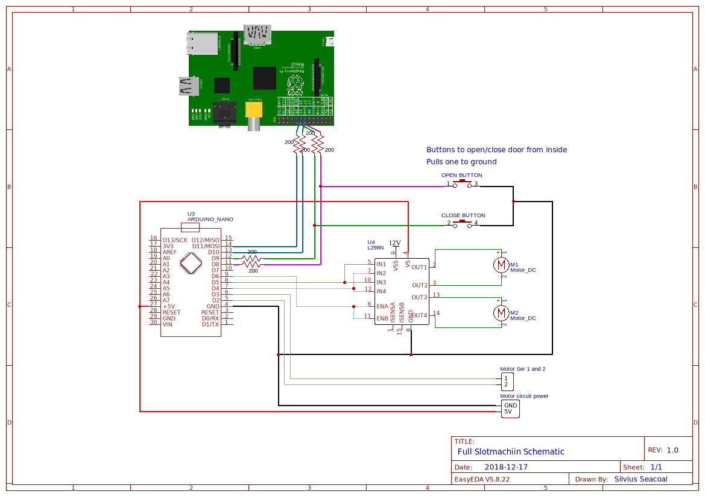

# SlotMachIIn
## IMPORTANT
Make sure to connect the ground of the Arduino with the ground of the Raspberry Pi!

## Files
Arduino : file that runs on the Arduino.
PI : files that run on the Raspberry PI.

## What pins are used?

#### On the Raspberry Pi:
PIN 27 looks like PIN 21 but it is actually Raspberry Pi 1 Rev 2 (2011.12)  
To get the Arduino's status for: open  -> PIN 27
				 close -> PIN 22

To send commands to the arduino: open  -> PIN 23
				 close -> PIN 24

#### On the Arduino:
This is the schematic, enjoy!

## How does it work?
No idea, but it does
